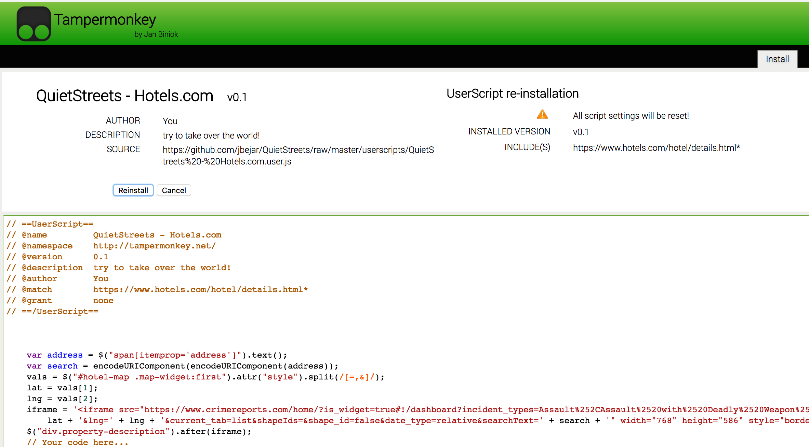
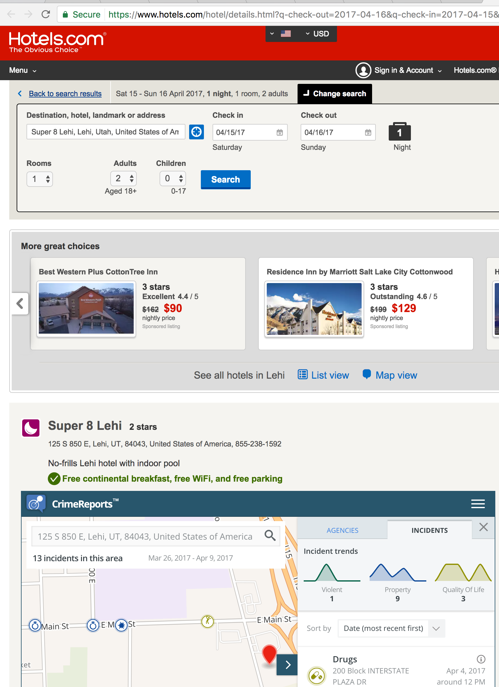

Userscript To Check Neighborhoods for crime around addresses appearing in popular lodging websites.

## Installation

1. Install a Userscript manager for your web browser.
  * [Tampermonkey - Chrome](https://chrome.google.com/webstore/detail/tampermonkey/dhdgffkkebhmkfjojejmpbldmpobfkfo?hl=en)
  * [Tampermonkey - Edge](https://tampermonkey.net/?browser=edge)
  * [Tampermonkey - Safari](https://tampermonkey.net/?ext=dhdg&browser=safari)
  * [Greasemonkey - Firefox](https://addons.mozilla.org/en-US/firefox/addon/greasemonkey/)
2. Download the scripts for the websites you need
  * Click [here](https://github.com/jbejar/QuietStreets/tree/master/userscripts) to go to userscripts folder
  * Click on file you want to Install, e.g. [Hotels.com](https://github.com/jbejar/QuietStreets/blob/master/userscripts/QuietStreets%20-%20Hotels.com.user.js)
  * Click on ["Raw"](https://github.com/jbejar/QuietStreets/raw/master/userscripts/QuietStreets%20-%20Hotels.com.user.js)
  * Click install inside the Tampermonkey plugin 
3. Navigate to the website, and you should see the embedded [CrimeReports.com](http://www.crimereports.com) map. By default it will display the surrounding area with crimes committed in the last week.
  
  * Note: CrimeReports.com does not include all police departments in it's system. Be sure to zoom out and check to see in the area if you are not seeing any crimes.
